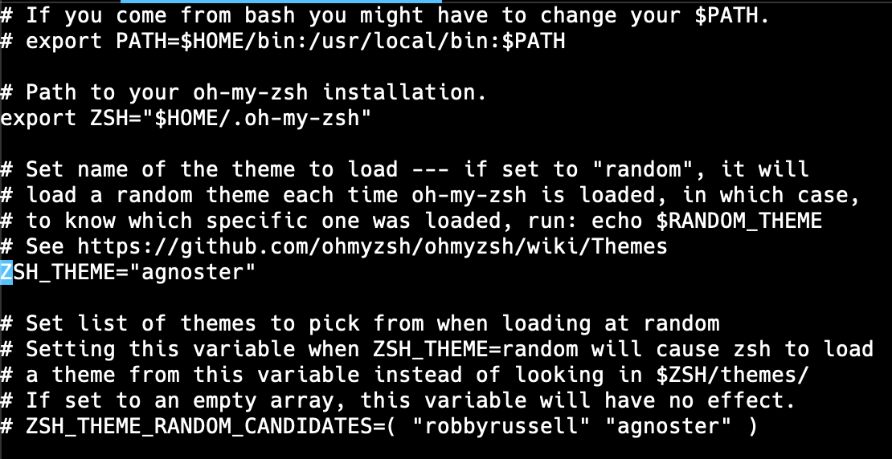
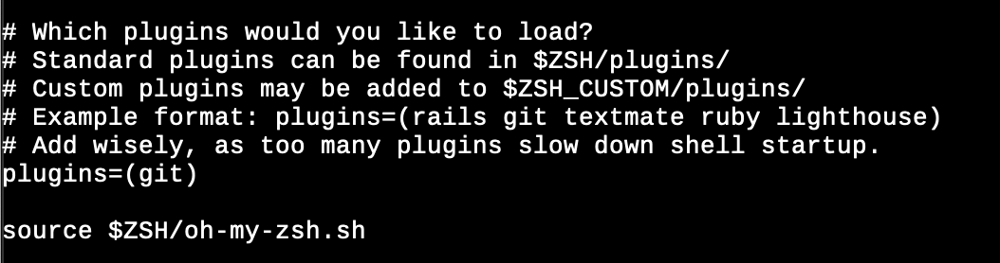

# 1. Warp

아래 홈페이지에서 다운받아서 설치 가능하다.

Warp homepage : [https://www.warp.dev/](https://www.warp.dev/)

<!--
# 2. Zsh

macOS Catalina 부터는 기본 shell이 zsh(/bin/zsh)로 되어 있다. 맥 시스템에서 사용하는 default 프로그램들은 경험상 대체적으로 건드리지 않는게 에러 발생이 안되고 좋은 것 같다.
따라서, 맥 패키지 관리 툴인 brew를 사용해서 설치, 제거, 업데이트 등이 용이하게 brew를 사용해서 zsh를 새로 설치해서 사용 한다.

```zsh
# Brew를 사용해서 zsh 설치
$ brew install zsh

# zsh 설치 된 위치 확인
$ which -a zsh

# 설치 된 zsh를 standard shell 목록에 추가
$ sudo vi /etc/shells #마지막 줄에 /usr/local/bin/zsh 를 추가하고 저장

# 기본 shell 변경
$ chsh -s /usr/local/bin/zsh
```

##### Shell 관련 명령어

```zsh
# 현재 사용중인 shell 확인
$ echo $SHELL

# 사용 가능한 shell 확인
$ cat /etc/shells
```

# 3. Oh-My-ZSH

### 1. Oh-My-ZSH 설치

Oh-My-ZSH homepage : [https://ohmyz.sh/](https://ohmyz.sh/)

```zsh
#1. Install oh-my-zsh via curl
$ sh -c "$(curl -fsSL https://raw.github.com/ohmyzsh/ohmyzsh/master/tools/install.sh)"

#2. Install oh-my-zsh via wget
$ sh -c "$(wget https://raw.github.com/ohmyzsh/ohmyzsh/master/tools/install.sh -O -)"
```

### 2. Oh-My-ZSH Theme 설정

#### 1) 기본 Theme 확인

```zsh
$ echo $ZSH_THEME
```

#### 2) Theme 확인 및 변경

Oh-My-ZSH의 테마는 여러가지가 있는데 아래 홈페이지에서 확인이 가능하다.

Oh-My-ZSH Theme github : [https://github.com/ohmyzsh/ohmyzsh/wiki/themes](https://github.com/ohmyzsh/ohmyzsh/wiki/themes)

홈페이지에서 사용하고 싶은 theme의 이름을 확인하고 zsh 설정 파일에서 테마를 설정한다.
Zsh, Oh-My-ZSH와 관련된 설정들은 ~/.zshrc에서 수정이 가능하다.

~/.zshrc에서 ZSH_THEME를 내가 원하는 테마 이름으로 변경하면 된다. 나는 agnoster로 설정을 했다.



#### 3) Prompt 컴퓨터 이름 삭제, User 이름만 사용

기본으로 설정 되어 있는 prompt에 user 이름 말고 컴퓨터 이름도 적혀있어서 매우 길고 불편하다. 따라서, 이 부분을 삭제한다.
~/.zshrc를 열고 아래 내용을 가장 마지막에 복사 해준다.

```vim
prompt_context() {
	if [[ "$USER" != "$DEFAULT_USER" || -n "$SSH_CLIENT" ]]; then
		prompt_segment black default "%(!.%.)$USER"
	fi
}
```

#### 4) plugin 사용

zsh에는 유용한 여러 plugin들이 있다. 명령어 자동 완성, 추천, syntax 하이라이트 등이 있다. zsh의 기본 plugin들은 이 위치(~/.oh-my-zsh/plugins/)에 설치 되어 있으며, 사용하려면 아래 그림과 같이 ~/.zshrc 설정 파일에서 plugins에 등록을 하면 된다.


설치 해볼 plugin은 이동한 적이 있는 폴더를 다시 이동 할 때, 모든 경로를 적지 않아도 이동하게 해주는 plugin으로 autojump이다.

```zsh
$ brew install autojump
```

위와 같이 설치를 해주고 ~/.zshrc에 plugins에 autojump를 추가하고 터미널을 재시작한다.

```vim
plugins=(git autojump)
```

# Nerd Font 설치

Nerd Fonts homepage : [https://www.nerdfonts.com/](https://www.nerdfonts.com/)

```zsh
$ brew tap homebrew/cask-fonts

# brew install --cask font-<FONT NAME>-nerd-font
$ brew install --cask font-hack-nerd-font
``` -->
